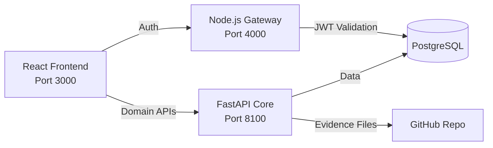
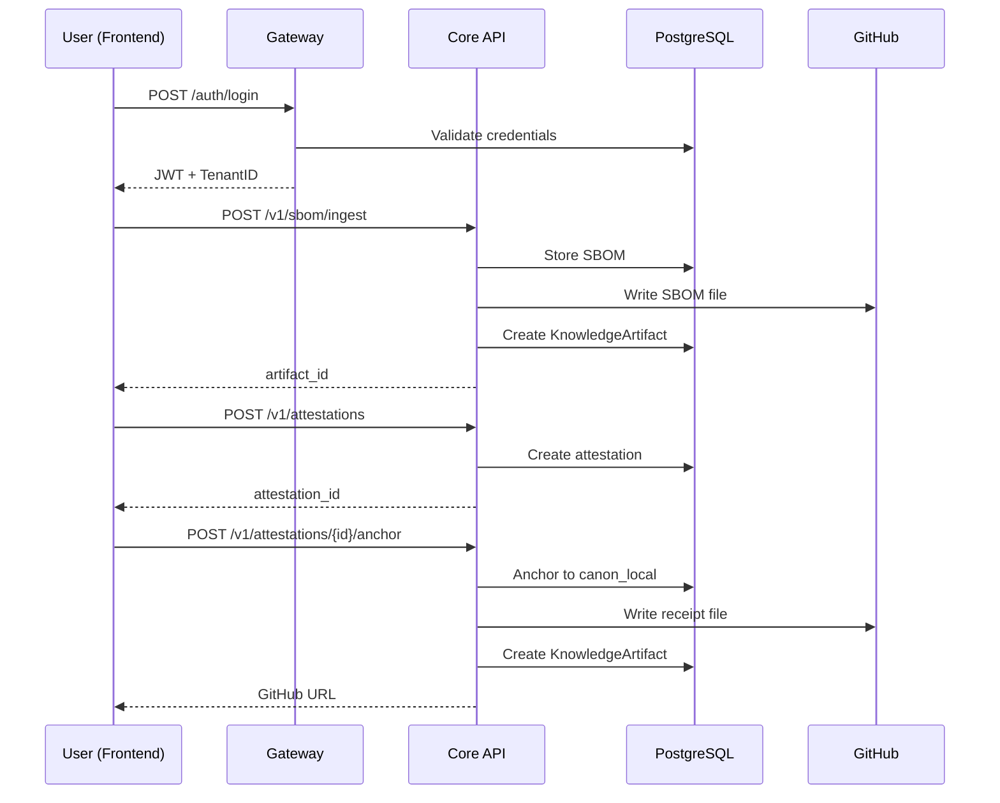

# Frontend-Backend Integration Plan
**CAP Platform - Complete Integration Strategy**

---

## Executive Summary

**Current State**:
- ✅ **Backend**: Fully functional FastAPI Core API + Node.js Gateway
- ✅ **Frontend**: React app with complete UI but using `mockApi.ts` (localStorage only)
- ❌ **Gap**: Frontend is **NOT** connected to backend - all API calls are mocked

**Goal**: Replace `mockApi.ts` with real API client that connects to:
1. **Gateway** (`http://localhost:4000`) - Authentication & user management
2. **Core API** (`http://127.0.0.1:8100`) - All domain logic (SBOM, Attestations, Evidence, Agents, etc.)

---

## Architecture Overview



### Current Backend Endpoints

#### Gateway (Node.js - Port 4000)
| Endpoint | Method | Purpose |
|----------|--------|---------|
| `/auth/login` | POST | User login, returns JWT tokens |
| `/auth/refresh` | POST | Refresh access token |
| `/me` | GET | Get current user info |

#### Core API (FastAPI - Port 8100)
| Domain | Key Endpoints | Status |
|--------|---------------|--------|
| **SBOM** | `POST /v1/sbom/ingest`<br/>`POST /v1/dbom/ingest` | ✅ Working + GitHub |
| **Attestations** | `POST /v1/attestations`<br/>`POST /v1/attestations/{id}/submit`<br/>`POST /v1/attestations/{id}/verify`<br/>`POST /v1/attestations/{id}/anchor` | ✅ Working + GitHub |
| **Evidence** | `POST /v1/evidence/upload`<br/>`GET /v1/evidence` | ✅ Working |
| **Frameworks** | `GET /v1/frameworks`<br/>`GET /v1/frameworks/{id}/controls` | ✅ Working |
| **AI Agents** | `POST /v1/ai/agents`<br/>`POST /v1/ai/agents/{id}/run`<br/>`POST /v1/ai/runs/{id}/promote` | ✅ Working + GitHub |
| **Policies** | `GET /v1/policies`<br/>`POST /v1/policies` | ✅ Working |
| **Knowledge** | `GET /v1/knowledge`<br/>`POST /v1/knowledge/ingest` | ✅ Working |

---

## Frontend API Structure Analysis

### Current Mock API Functions (mockApi.ts)

| Category | Functions | Backend Equivalent |
|----------|-----------|-------------------|
| **Auth** | `login()`, `getCurrentUser()`, `logout()` | Gateway `/auth/*`, `/me` |
| **Tenants** | `getTenants()`, `createTenant()`, `updateTenant()` | ❌ **MISSING** in backend |
| **Users** | `getUsers()`, `createUser()`, `updateUser()` | ❌ **MISSING** in backend |
| **Policies** | `getPolicies()`, `createPolicy()`, `updatePolicy()` | Core `/v1/policies` |
| **Evidence** | `getEvidence()`, `submitEvidence()`, `deleteEvidence()` | Core `/v1/evidence` |
| **Attestations** | `getAttestations()`, `createAttestation()`, `verifyAttestation()`, `verifyScittAttestation()` | Core `/v1/attestations` |
| **Frameworks** | `getFrameworks()`, `getControlsForFramework()`, `getCrosswalksForControl()` | Core `/v1/frameworks` |
| **Findings** | `getFindings()`, `updateFinding()` | ❌ **MISSING** in backend |
| **Threat Intel** | `getDisinformationCases()`, `createDisinformationCase()` | ❌ **MISSING** in backend |

---

## Integration Strategy

### Phase 1: Foundation Setup (2-3 hours)

#### 1.1 Create API Client Service
**File**: `frontend/services/apiClient.ts`

```typescript
import axios, { AxiosInstance } from 'axios';

const GATEWAY_URL = import.meta.env.VITE_GATEWAY_URL || 'http://localhost:4000';
const CORE_URL = import.meta.env.VITE_CORE_URL || 'http://127.0.0.1:8100';

class ApiClient {
  private gatewayClient: AxiosInstance;
  private coreClient: AxiosInstance;
  private accessToken: string | null = null;
  private tenantId: string | null = null;

  constructor() {
    this.gatewayClient = axios.create({
      baseURL: GATEWAY_URL,
      headers: { 'Content-Type': 'application/json' },
    });

    this.coreClient = axios.create({
      baseURL: CORE_URL,
      headers: { 'Content-Type': 'application/json' },
    });

    // Request interceptor: Add auth headers
    this.coreClient.interceptors.request.use((config) => {
      if (this.accessToken) {
        config.headers.Authorization = `Bearer ${this.accessToken}`;
      }
      if (this.tenantId) {
        config.headers['x-tenant-id'] = this.tenantId;
      }
      return config;
    });

    // Response interceptor: Handle 401 and refresh
    this.coreClient.interceptors.response.use(
      (response) => response,
      async (error) => {
        if (error.response?.status === 401) {
          await this.refreshToken();
          return this.coreClient.request(error.config);
        }
        return Promise.reject(error);
      }
    );
  }

  setAuth(accessToken: string, tenantId: string) {
    this.accessToken = accessToken;
    this.tenantId = tenantId;
  }

  clearAuth() {
    this.accessToken = null;
    this.tenantId = null;
  }

  async refreshToken() {
    const refreshToken = localStorage.getItem('refreshToken');
    if (!refreshToken) throw new Error('No refresh token');

    const response = await this.gatewayClient.post('/auth/refresh', { refreshToken });
    this.accessToken = response.data.accessToken;
    localStorage.setItem('accessToken', this.accessToken);
  }

  // --- Auth APIs (Gateway) ---
  async login(email: string, password: string) {
    const response = await this.gatewayClient.post('/auth/login', { email, password });
    const { accessToken, refreshToken, user } = response.data;
    
    this.setAuth(accessToken, user.tenant.id);
    localStorage.setItem('accessToken', accessToken);
    localStorage.setItem('refreshToken', refreshToken);
    localStorage.setItem('tenantId', user.tenant.id);
    
    return response.data;
  }

  async getCurrentUser() {
    const response = await this.gatewayClient.get('/me', {
      headers: { Authorization: `Bearer ${this.accessToken}` },
    });
    return response.data.user;
  }

  // --- Core API Methods ---
  async ingestSbom(format: string, buildDigest: string, rawJson: any) {
    const response = await this.coreClient.post('/v1/sbom/ingest', {
      format,
      build_digest: buildDigest,
      raw_json: rawJson,
    });
    return response.data;
  }

  async createAttestation(subjectId: string, type: string, issuerJson: any, statement: any, refs: string[]) {
    const response = await this.coreClient.post('/v1/attestations', {
      subject_id: subjectId,
      type,
      issuer_json: issuerJson,
      statement,
      refs,
    });
    return response.data;
  }

  async anchorAttestation(attestationId: string) {
    const response = await this.coreClient.post(`/v1/attestations/${attestationId}/anchor`, {}, {
      headers: { 'Idempotency-Key': crypto.randomUUID() },
    });
    return response.data;
  }

  async runAgent(agentId: string, inputText: string) {
    const response = await this.coreClient.post(`/v1/ai/agents/${agentId}/run`, {
      input_text: inputText,
      subject_ids: [],
      attestation_ids: [],
      evidence_ids: [],
      artifact_ids: [],
    });
    return response.data;
  }

  async promoteAgentRun(runId: string, title: string, summary: string, tags: string[]) {
    const response = await this.coreClient.post(`/v1/ai/runs/${runId}/promote`, {
      title,
      summary,
      tags,
      subject_ids: [],
      knowledge_artifact_ids: [],
    });
    return response.data;
  }

  // Add more methods as needed...
}

export const apiClient = new ApiClient();
```

#### 1.2 Update Environment Variables
**File**: `frontend/.env`

```env
VITE_GATEWAY_URL=http://localhost:4000
VITE_CORE_URL=http://127.0.0.1:8100
VITE_GITHUB_REPO_URL=https://github.com/asherxor/cap-bank-demo-kb
```

#### 1.3 Install Dependencies
```bash
cd frontend
npm install axios
```

---

### Phase 2: Authentication Flow (2 hours)

#### 2.1 Update Login Screen
**File**: `frontend/components/screens/LoginScreen.tsx`

Replace mock login with real API:

```typescript
import { apiClient } from '../../services/apiClient';

const handleLogin = async () => {
  try {
    setIsLoading(true);
    const response = await apiClient.login(email, password);
    
    // Store user in context/state
    setUser(response.user);
    setActiveScreen('dashboard');
  } catch (error) {
    console.error('Login failed:', error);
    setError('Invalid credentials');
  } finally {
    setIsLoading(false);
  }
};
```

#### 2.2 Create Auth Context
**File**: `frontend/contexts/AuthContext.tsx`

```typescript
import React, { createContext, useState, useEffect } from 'react';
import { apiClient } from '../services/apiClient';

interface AuthContextType {
  user: any | null;
  login: (email: string, password: string) => Promise\u003cvoid\u003e;
  logout: () => void;
  isLoading: boolean;
}

export const AuthContext = createContext\u003cAuthContextType\u003e(null!);

export const AuthProvider: React.FC\u003c{ children: React.ReactNode }\u003e = ({ children }) => {
  const [user, setUser] = useState\u003cany | null\u003e(null);
  const [isLoading, setIsLoading] = useState(true);

  useEffect(() => {
    const token = localStorage.getItem('accessToken');
    const tenantId = localStorage.getItem('tenantId');
    
    if (token && tenantId) {
      apiClient.setAuth(token, tenantId);
      apiClient.getCurrentUser()
        .then(setUser)
        .catch(() => apiClient.clearAuth())
        .finally(() => setIsLoading(false));
    } else {
      setIsLoading(false);
    }
  }, []);

  const login = async (email: string, password: string) => {
    const response = await apiClient.login(email, password);
    setUser(response.user);
  };

  const logout = () => {
    apiClient.clearAuth();
    localStorage.clear();
    setUser(null);
  };

  return (
    \u003cAuthContext.Provider value={{ user, login, logout, isLoading }}\u003e
      {children}
    \u003c/AuthContext.Provider\u003e
  );
};
```

---

### Phase 3: Domain APIs Integration (4-6 hours)

#### 3.1 Attestations Screen
**File**: `frontend/components/screens/AttestationsScreen.tsx`

```typescript
import { apiClient } from '../../services/apiClient';

// Replace mockApi calls:
const createAttestation = async () => {
  const response = await apiClient.createAttestation(
    subjectId,
    type,
    issuerJson,
    statement,
    refs
  );
  // Update local state
};

const anchorAttestation = async (id: string) => {
  const response = await apiClient.anchorAttestation(id);
  // Show GitHub URL from response.anchors[0].data.public_proof.url
};
```

#### 3.2 Evidence Screen
**File**: `frontend/components/screens/EvidenceScreen.tsx`

```typescript
const submitEvidence = async (file: File) => {
  const formData = new FormData();
  formData.append('file', file);
  
  const response = await apiClient.coreClient.post('/v1/evidence/upload', formData, {
    headers: { 'Content-Type': 'multipart/form-data' },
  });
  
  // Refresh evidence list
};
```

#### 3.3 AI Agent Screen (NEW!)
**File**: `frontend/components/screens/AIAgentsScreen.tsx`

```typescript
const runAgent = async (agentId: string, input: string) => {
  setIsRunning(true);
  try {
    const runResponse = await apiClient.runAgent(agentId, input);
    
    // Promote to evidence
    const promoteResponse = await apiClient.promoteAgentRun(
      runResponse.id,
      'Agent Analysis',
      'Compliance assessment',
      ['compliance', 'analysis']
    );
    
    // Show GitHub report link
    alert(`Report created! Evidence ID: ${promoteResponse.evidence_id}`);
  } finally {
    setIsRunning(false);
  }
};
```

---

### Phase 4: Missing Backend Endpoints (3-4 hours)

> [!IMPORTANT]
> Some frontend features don't have backend equivalents yet. We need to implement these:

#### 4.1 Tenant Management
**Backend TODO**: Create `/v1/tenants` endpoints in Core API

```python
# core/app/routers/tenants.py
@router.get("", response_model=List[TenantResponse])
async def list_tenants(session: AsyncSession = Depends(get_rls_session)):
    # Implementation

@router.post("", response_model=TenantResponse)
async def create_tenant(payload: TenantCreate, session: AsyncSession = Depends(get_rls_session)):
    # Implementation
```

#### 4.2 User Management
**Backend TODO**: Create `/v1/users` endpoints in Core API or Gateway

#### 4.3 Findings
**Backend TODO**: Create `/v1/findings` endpoints

#### 4.4 Threat Intelligence (Disinformation Cases)
**Backend TODO**: Create `/v1/threat-intel/cases` endpoints

---

### Phase 5: CORS & Deployment (1 hour)

#### 5.1 Update Backend CORS
**File**: `core/app/main.py`

```python
app.add_middleware(
    CORSMiddleware,
    allow_origins=["http://localhost:3000", "http://localhost:5173"],  # Vite dev server
    allow_credentials=True,
    allow_methods=["*"],
    allow_headers=["*"],
)
```

**File**: `gateway/src/index.ts`

```typescript
app.use(cors({
  origin: ['http://localhost:3000', 'http://localhost:5173'],
  credentials: true,
}));
```

#### 5.2 Start All Services
```powershell
# Terminal 1: Core API
.\scripts\run.core.win.ps1

# Terminal 2: Gateway
.\scripts\run.gateway.win.ps1

# Terminal 3: Frontend
cd frontend
npm run dev
```

---

## Implementation Checklist

### ✅ Completed (Backend)
- [x] SBOM ingestion with GitHub integration
- [x] Attestation lifecycle with anchoring
- [x] AI Agent runs with GitHub reports
- [x] Evidence management
- [x] Framework/Policy management
- [x] Authentication (Gateway)

### 🔄 In Progress (Frontend Integration)
- [ ] Create `apiClient.ts` service
- [ ] Replace mockApi in LoginScreen
- [ ] Replace mockApi in AttestationsScreen
- [ ] Replace mockApi in EvidenceScreen
- [ ] Create AIAgentsScreen (new!)
- [ ] Update DashboardScreen with real data

### ⏳ TODO (Backend)
- [ ] Implement `/v1/tenants` endpoints
- [ ] Implement `/v1/users` endpoints (or move to Gateway)
- [ ] Implement `/v1/findings` endpoints
- [ ] Implement `/v1/threat-intel/cases` endpoints

### ⏳ TODO (Frontend)
- [ ] Add loading states
- [ ] Add error handling
- [ ] Add retry logic
- [ ] Add offline mode detection
- [ ] Update TypeScript types to match backend schemas

---

## Data Flow Example: SBOM Attestation



---

## Testing Plan

### Unit Tests
- [ ] Test apiClient methods
- [ ] Test auth interceptors
- [ ] Test error handling

### Integration Tests
- [ ] Login flow
- [ ] SBOM → Attestation → Anchor flow
- [ ] Agent run → Promotion flow
- [ ] Evidence upload

### E2E Tests (Playwright/Cypress)
- [ ] Complete user journey
- [ ] Error scenarios
- [ ] Token refresh

---

## Timeline Estimate

| Phase | Tasks | Estimated Time |
|-------|-------|----------------|
| **Phase 1** | API Client Setup | 2-3 hours |
| **Phase 2** | Authentication | 2 hours |
| **Phase 3** | Domain Integration | 4-6 hours |
| **Phase 4** | Missing Endpoints | 3-4 hours |
| **Phase 5** | CORS & Deployment | 1 hour |
| **Testing** | All tests | 3-4 hours |
| **TOTAL** | | **15-20 hours** |

---

## Next Steps (Priority Order)

1. ✅ **Start Core & Gateway** - Already running
2. **Create apiClient.ts** - Foundation for all API calls
3. **Implement Authentication** - AuthContext + Login screen
4. **Test with one screen** - Attestations or Evidence
5. **Expand to other screens** - Dashboard, Frameworks, etc.
6. **Build missing backend endpoints** - Tenants, Users, Findings
7. **Deploy & Test** - Full integration testing

---

**Created**: 2025-11-25  
**Status**: Ready for Implementation  
**Complexity**: Medium (15-20 hours total)
